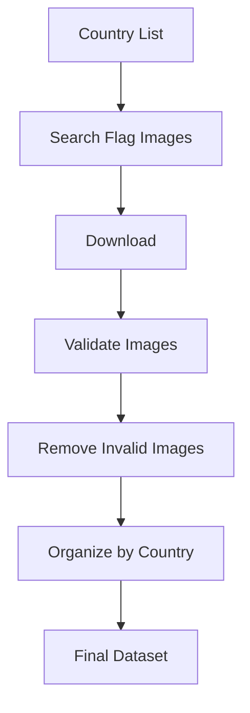
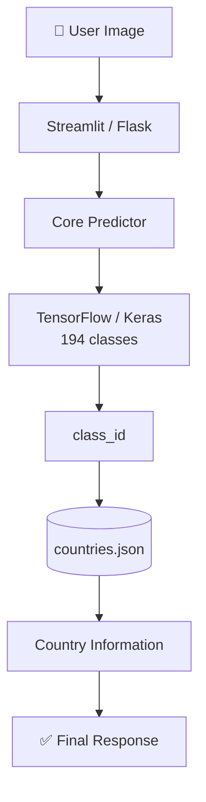

<div align="center">

---

## 📌 Table of Contents

|                                                  |                                    |                                                   |
| ------------------------------------------------ | ---------------------------------- | ------------------------------------------------- |
| [About](#-about-the-project)                      | [Key Features](#-key-features)      | [How It Works](#-how-it-works)                     |
| [The Model](#-machine-learning-model)             | [Dataset](#-dataset)                | [Country Database](#-country-information-database) |
| [Project Structure](#-project-structure)          | [Quick Start](#-quick-start)        | [REST API](#-rest-api)                             |
| [Testing &amp; Evaluation](#-testing--evaluation) | [Use Cases](#-where-can-it-be-used) | [Limitations](#-limitations)                       |
| [Roadmap](#-roadmap)                              | [Architecture](#-architecture)      | [Author](#-author)                                 |

---

## 🌎 About the Project

**World Flag AI** is a computer vision application that recognizes national flags from images and returns a rich profile of the identified country — capital, currency, languages, history, neighbors, and more.

It ships with **two interfaces that share one prediction core**, so the logic is written once and reused everywhere:

| Interface                   | Purpose                                                                              |
| --------------------------- | ------------------------------------------------------------------------------------ |
| 🖥️**Streamlit App** | A friendly UI — upload an image, get an instant visual result                       |
| 🔌**Flask REST API**  | A JSON endpoint for integrating flag recognition into other apps, sites, or services |

> **Goal:** demonstrate an end-to-end applied ML product — dataset creation → training → evaluation → deployment — using Python, computer vision, and web development together.

---

## ✨ Key Features

<table>
<tr>
<td width="50%" valign="top">

**Example prediction:**

```text
🇲🇽 Mexico — United Mexican States        96.82% confidence

Top-5:
1. Mexico     96.82%      4. Peru        0.51%
2. Ecuador     1.42%      5. Bolivia     0.31%
3. Colombia    0.73%
```

---

## 🧠 How It Works


---

## 🤖 Machine Learning Model

| Property     | Value                                                                                                                |
| ------------ | -------------------------------------------------------------------------------------------------------------------- |
| Framework    | TensorFlow / Keras                                                                                                   |
| Model file   | `World_Flag_AI_final.keras` (~68 MB)                                                                               |
| Input shape  | `300 × 300 × 3` (RGB)                                                                                            |
| Output shape | `194` classes                                                                                                      |
| Indexing     | Model output is 0-indexed; the project maps it to a 1-indexed`class_id` (e.g. model index `0` → `class_id 1`) |

---

## 📊 Dataset

The dataset contains **194 country-labeled folders**, one per class, built via an automated collection pipeline:



Images span official flag graphics, real-world photos, varied lighting, backgrounds, and resolutions — giving the model exposure to realistic, imperfect conditions rather than only clean vector flags.

> **Note:** the dataset intentionally includes **Palestine** and does not include **Israel**.

Before training, images are validated, split into train/validation sets, and resized to `300 × 300`. All images are converted to RGB to ensure consistent 3-channel input, regardless of source format.

---

## 🗂️ Country Information Database

Stored in `country_data/countries.json`, this file maps each `class_id` to a full country record:

```json
{
    "class_id": 109,
    "country_name": "Mexico",
    "official_name": "United Mexican States",
    "capital": "Mexico City",
    "continent": "North America",
    "region": "North America",
    "subregion": "Central America",
    "iso_alpha_2": "MX",
    "iso_alpha_3": "MEX",
    "independence_date": "16 September 1810",
    "national_day": "16 September",
    "currency": "Mexican peso (MXN)",
    "languages": "Spanish and numerous Indigenous languages",
    "flag_description": "...",
    "short_history": "...",
    "interesting_fact": "...",
    "neighbors": "United States, Guatemala, Belize"
}
```

This separation keeps the model focused purely on visual classification, while the JSON database supplies all human-readable context.

---

## 🧩 Core Predictor (`core/predictor.py`)

<details>
<summary><b>Click to expand the predictor's responsibilities</b></summary>

<br>

| Step | What it does                                                |
| ---- | ----------------------------------------------------------- |
| 1    | Load`countries.json`                                      |
| 2    | Validate all 194 records exist, with`class_id` 1 → 194   |
| 3    | Verify Palestine is present                                 |
| 4    | Verify Israel is absent                                     |
| 5    | Load`World_Flag_AI_final.keras`                           |
| 6    | Validate model input shape`(None, 300, 300, 3)`           |
| 7    | Validate model output shape`(None, 194)`                  |
| 8    | Preprocess: RGB → resize → NumPy array → batch dimension |
| 9    | Run prediction across 194 classes                           |
| 10   | Select the highest-probability class                        |
| 11   | Compute the Top-5 predictions                               |

</details>

---

## 📁 Project Structure

```text
World_Flag_AI_App/
│
├── README.md
├── requirements.txt
├── generate_countries.py
├── enrich_countries.py
│
├── core/
│   ├── predictor.py          # Loads model, runs predictions
│   └── country_info.py       # Loads country metadata
│
├── country_data/
│   └── countries.json        # Country metadata (194 records)
│
├── model/
│   └── World_Flag_AI_final.keras
│
├── flask_app/
│   ├── app.py
│   ├── routes.py
│   ├── static/{css,js}/
│   └── templates/index.html
│
├── streamlit_app/
│   └── app.py
│
└── tests/
    ├── test_model.py
    ├── test_predictor.py
    └── test_images/
```

---

## ⚙️ Quick Start

```bash
# 1. Clone the repository
git clone https://github.com/YOUR_USERNAME/World_Flag_AI_App.git
cd World_Flag_AI_App

# 2. Create & activate a virtual environment
python -m venv .venv
.venv\Scripts\Activate.ps1        # Windows PowerShell
# source .venv/bin/activate       # macOS/Linux

# 3. Install dependencies
pip install -r requirements.txt
```

**Core dependencies:** `Python` · `TensorFlow 2.20.0` · `Keras` · `NumPy` · `Pillow` · `Flask` · `Streamlit`
(exact pins live in `requirements.txt`)

### Run the Streamlit app

```bash
streamlit run streamlit_app/app.py
```

➡️ Opens at `http://localhost:8501`

### Run the Flask app

```bash
python flask_app/app.py
```

➡️ Runs at `http://127.0.0.1:5000` · Health check at `/health`

---

## 🌐 REST API

### `POST /api/predict`

Send an image and receive a full classification + country profile.

```bash
curl -X POST http://127.0.0.1:5000/api/predict \
  -F "image=@flag.jpg"
```

**Response fields:**

| Field                  | Description                                 |
| ---------------------- | ------------------------------------------- |
| `class_id`           | Predicted class index (1–194)              |
| `country`            | Predicted country name                      |
| `confidence`         | Raw probability (0–1)                      |
| `confidence_percent` | Confidence as a percentage                  |
| `top_predictions`    | Top-5 ranked predictions                    |
| `country_info`       | Full country profile from`countries.json` |

### `GET /health`

Returns service status and model metadata:

```json
{
    "status": "online",
    "classes": 194,
    "image_size": [300, 300]
}
```

---

## 🧪 Testing & Evaluation

Tests live in `tests/` (`test_model.py`, `test_predictor.py`, plus a `test_images/` set), including **class-by-class confusion analysis** to surface which flags the model finds hardest.

<details>
<summary><b>🔍 Commonly confused flag pairs</b></summary>

<br>

| Class A        | Often confused with              |
| -------------- | -------------------------------- |
| Congo          | Democratic Republic of the Congo |
| Netherlands    | Luxembourg                       |
| Austria        | Monaco / Latvia                  |
| Chad           | Romania                          |
| Guinea         | Benin                            |
| Côte d'Ivoire | Ireland                          |
| Italy          | Monaco                           |

These are hard cases because the flags share very similar colors, layouts, or proportions.

</details>

<details>
<summary><b>📈 Before → after model improvement (sample)</b></summary>

<br>

| Country    | Before | After   |
| ---------- | ------ | ------- |
| Luxembourg | 40%    | ✅ 100% |
| Libya      | 60%    | ✅ 100% |
| Argentina  | 60%    | ✅ 100% |
| Bahrain    | 60%    | ✅ 100% |
| Austria    | 20%    | 60%     |

| Country     | Before | After |
| ----------- | ------ | ----- |
| Congo       | 60%    | ❌ 0% |
| Netherlands | 60%    | ❌ 0% |
| Italy       | 100%   | 60%   |
| Finland     | 100%   | 60%   |
| Bolivia     | 80%    | 40%   |

This trade-off is exactly why **per-class evaluation** matters more than a single overall accuracy number when tuning a multi-class classifier.

</details>

---

## 🌍 Where Can It Be Used?

| Use Case                         | Description                                                                               |
| -------------------------------- | ----------------------------------------------------------------------------------------- |
| 🎓**Education**            | Interactive geography tool — flag in, capital/history/currency out                       |
| 🧳**Travel Apps**          | Identify flags in travel photos, airports, tourist sites                                  |
| 🏫**Quizzes & Games**      | AI-verified flag-guessing games for classrooms or apps                                    |
| 📱**Mobile Backends**      | Flask API powers a "snap a photo, get the country" mobile flow                            |
| 🌐**Web Integrations**     | Drop the API into educational portals, travel sites, quizzes                              |
| 🔬**CV Research/Teaching** | Reference example of multi-class classification, dataset creation, and confusion analysis |

---

## 🛑 Limitations

- **Visually similar flags** (e.g. Congo/DRC, Chad/Romania, Netherlands/Luxembourg) remain challenging for the model.
- **Low-quality images** — blurry, dark, cropped, heavily compressed, or obstructed flags — reduce accuracy.
- **Non-flag images**: since this is a closed-set classifier, it will still return one of its 194 known classes even for out-of-distribution images (no built-in "not a flag" detector yet — see roadmap).

---

## 🔮 Roadmap

- [ ] Expand and diversify training data, especially for confusable classes
- [ ] Add a confidence threshold with an "unable to confidently identify" fallback
- [ ] Clean dataset further (duplicates, logos, maps, watermarks)
- [ ] Native mobile app powered by the Flask API
- [ ] Live camera flag detection
- [ ] Expand country database (population, area, time zones, landmarks, government)
- [ ] Multilingual country information
- [ ] Optimize model for faster, lighter, edge/mobile inference

---

## 🏗️ Architecture



---

## 🛠️ Tech Stack

| Layer    | Technologies                     |
| -------- | -------------------------------- |
| Language | Python                           |
| ML / CV  | TensorFlow, Keras, NumPy, Pillow |
| Frontend | Streamlit, HTML, CSS, JavaScript |
| Backend  | Flask, REST API                  |
| Data     | JSON, custom image dataset       |
| Tooling  | Git, GitHub, VS Code, venv       |

---

## 📜 License

This project is intended for **educational, research, and demonstration purposes**. Dataset images may carry their own individual licenses — verify licensing before any commercial use.

---

## 👨‍💻 Author

<div align="center">
